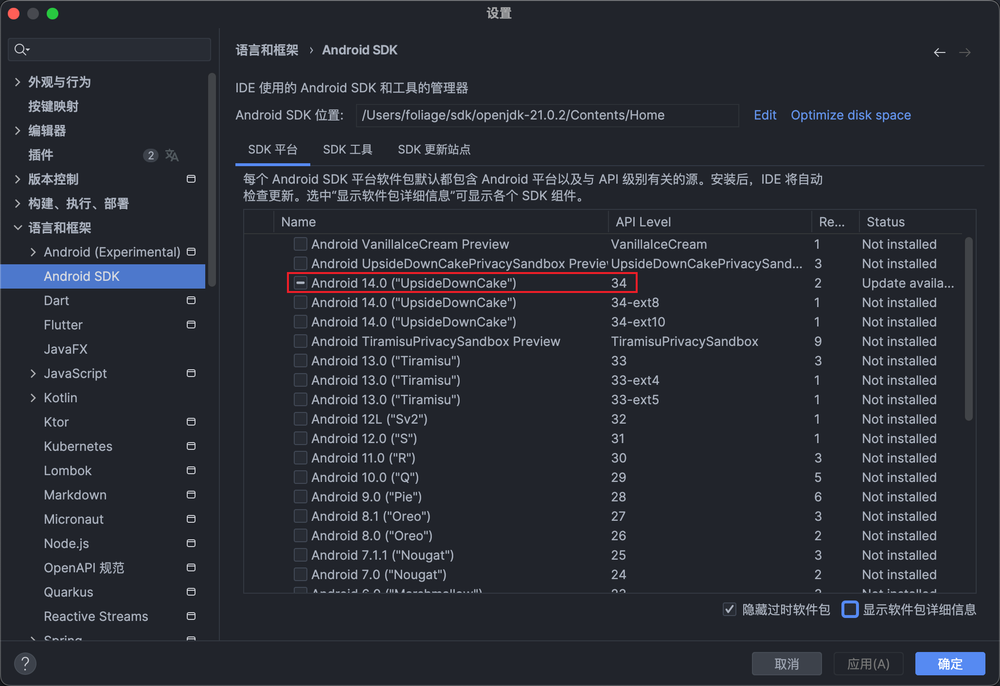
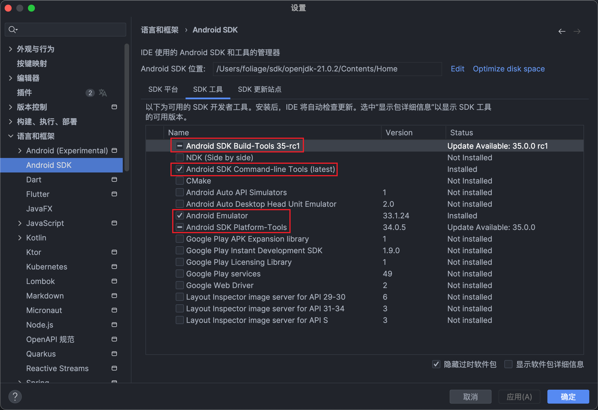

### 参考

[Flutter官方文档]('https://flutter.cn/docs')

### 1. 推荐使用 [fvm]('https://fvm.app/') 进行 Flutter SDK 的版本管理
- 首先需要安装 HomeBrew
- 安装
```bash
brew tap leoafarias/fvm
brew install fvm
```
- 卸载
```bash
brew uninstall fvm
brew untap leoafarias/fvm
```

### 2. 安装指定版本的 Flutter SDK
```bash
fvm install 3.10.5
```

### 3. 选择指定版本的 Flutter SDK 的作为项目 SDK
```bash
fvm use 3.10.5

fvm flutter doctor -v
fvm flutter --version
# ...
```

### 4. 设置全局默认的 Flutter SDK
```bash
fvm global 3.10.5
```
- 添加环境变量
```bash
code ~/.zshrc

# Flutter
export PATH=$HOME/fvm/versions/default/bin:$PATH
```


### 5. 安装 [Android Studio]('https://developer.android.com/?hl=zh-cn')

- 下载 Android SDK 和 JDK





- 添加 adb 工具到环境变量
```bash
# adb
export PATH=$HOME/sdk/openjdk-21.0.2/Contents/Home/platform-tools:$PATH
```


